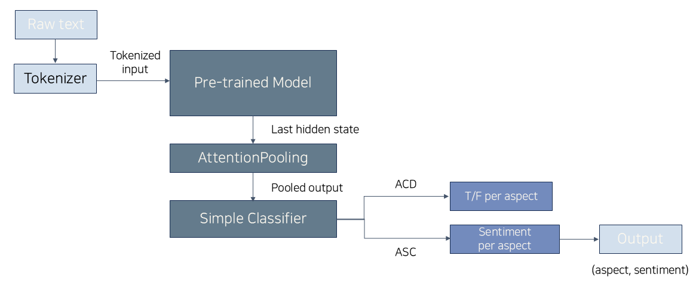

# myPortfolio
# Introduction

# Projects
## 1. shortcut_2_ur_shampoo.txt
- 올리브영 샴푸 리뷰 ABSA 프로젝트
  
### Period
- 2025.05.12 ~ 2025.06.13 (약 1개월)

### Motivation
- 온라인 쇼핑 시 구매 결정에 활용하는 리뷰 정보의 불충분 및 부적절함
  - 쇼핑 플랫폼에서 정한 특정 속성에 대해 리뷰어가 리뷰 작성 시 직접 선택한 결과를 집계
  - 속성의 종류가 다양하지 않고 해당 집계 정보는 임의로 선택할 가능성이 높은 지표에 의존
    
  \* 샴푸 카테고리 선정 이유?\
      - 남녀노소 일상적으로 사용하는 대표적인 생활용품으로 구매 결정의 효율의 높일 필요\
      - 리뷰에서 추출할 수 있는 속성이 다양하여 ABSA task 수행하기에 적절\
      - 다른 세부 카테고리에 비해 리뷰 내 개개인의 특징이 적어, 리뷰로부터 제품에 대한 소비자 반응 추출에 적합
  
### Goal
- 샴푸를 구매하고자 하는 소비자들의 결정에 도움이 되는 리뷰 정보 제공
  - AI 모델을 통해 각 리뷰의 속성 별 감성을 자동 라벨링
  - 각 제품 별 리뷰 기반 통계 정보 및 시각 자료 제공  

### Method
- 속성 별 감성 라벨링을 위한 ABSA task 수행

  **(1) Data Collection**
    - 올리브영 샴푸 카테고리 데이터 크롤링
      - 출처: 올리브영 홈페이지
      - 방법: 크롤링 (BeautifulSoup, Selenium)
      - 대상: 제품 정보 (총 560개),  리뷰 정보 (총 215,241개)
    - 수작업 라벨링
      - 목적: ABSA 모델링을 위한 정답 데이터 생성
      - 방법: Doccano 를 활용해 각 리뷰에 (속성, 감성) 쌍 라벨링
        - 총 1,569개의 리뷰 레이블 획득
        
  **(2) Data Preprocessing**
    - 결측치 처리
      - 리뷰 텍스트가 결측치인 경우 삭제
      - 올리브영에서 제공하는 속성 범주가 [세정, 향, 자극, 거품] 이 아닌 경우 삭제
    - 중복값 처리
      - 같은 제품명을 가진 동일 리뷰가 존재하는 경우 삭제
      - 다른 브랜드에 동일 리뷰가 등록된 경우 삭제
    - 특정 제품군 삭제
      - 일반 샴푸의 속성과 큰 차이가 있는 제품군 삭제
        - 스케일러, 드라이샴푸
    - 데이터 정제
      - 한글, 영어, 숫자, 공백, 직접 지정한 특수문자 이외의 문자 모두 제거
      - 소괄호 안 부연설명 삭제
      - 반복되는 어구 축약
        - ex. ㅋㅋㅋㅋㅋㅋㅋㅋㅋㅋ -> ㅋㅋㅋ
      - 문장부호 통일
        - ex. !!!! -> !
      - 띄어쓰기 보정
        - PyKoSpacing 라이브러리 사용
      - 협찬 문구 삭제
        - ex. "판매자에게 이벤트 상금을 지원 받아 직접 구매 후 솔직한 의견으로 작성하였습니다"
            
  **(3) Modeling**
    - 모델 학습 방법
      - 한국어의 문맥을 잘 파악하는 BERT 기반 사전 학습 모델을 전이 학습
        - 적은 양의 라벨링 데이터를 모델링에 이용하였다는 한계 고려
      - 사전 학습 모델
        - ASC: kykim/electra-kor-base
          - 대용량의 국내 커머스 리뷰가 데이터셋에 포함된 해당 프로젝트의 데이터와 가장 적합
        - ACD: klue/roberta-base
          - 전체적인 문맥 파악이 중요한 감성분석에 유리
    - 모델 구조\
      
      - AttentionPooling 사용
        - 문장에서 속성 추출에 중요한 토큰들에 집중하도록 하고 다중 속성들의 감정 혼합 문제를 보완
          - 입력 문장 내 다중 속성을 잘 추출하기 위함
    - 모델링 요소
      - GradScaler : 훈련 속도 향상
      - LayerNorm : 안정적 학습
      - label_smoothing, compute_class_weight : 클래스 불균형 완화
    - 하이퍼파라미터 설정
      - maxlen = 128
        - 다중 속성을 추출하고 문맥에 따라 감성 파악하므로, 정보 손실 크지 않게 리뷰 길이의 3분위수 이상으로 넉넉히 설정
      - truncating = "pre"
        - 직접 함수 정의해서 사용
          
  **(4) Optimization**
    - 데이터 증강
      - 역번역 (Back Translation) 사용
        - 문장 구조 다양화 및 높은 의미 보존
      - 감성 클래스 불균형 완화 목적
        - 중립, 부정 클래스의 데이터 증강
       
    - 속성 추가
      - 기존에 기타 속성으로 분류했던 탈모와 쿨링 속성을 분리
     
    - 불확실한 예측 처리
      - 속성 예측 확률이 특정 값 (threshold) 이하인 경우 ‘없음’ 속성으로 라벨링하도록 설계
      - 예측의 confidence 통계값이 높은 것을 확인 후 threshold 를 0.9 이상으로 설정

  **(5) Score**
    - 성능
### Results
  - web 기능 설명
  - 발표 pdf 파일 첨부

### Review
  - 개선, 발전방향
  - 아쉬운점, 어려웠던 점

### Role

기술, 협업
- (태블로 대시보드 추가)

2. 따봄
- 따릉이 분석 프로젝트
- (회귀로 수요 예측 누락부분 채우기)
- pdf 발표자료 링크
